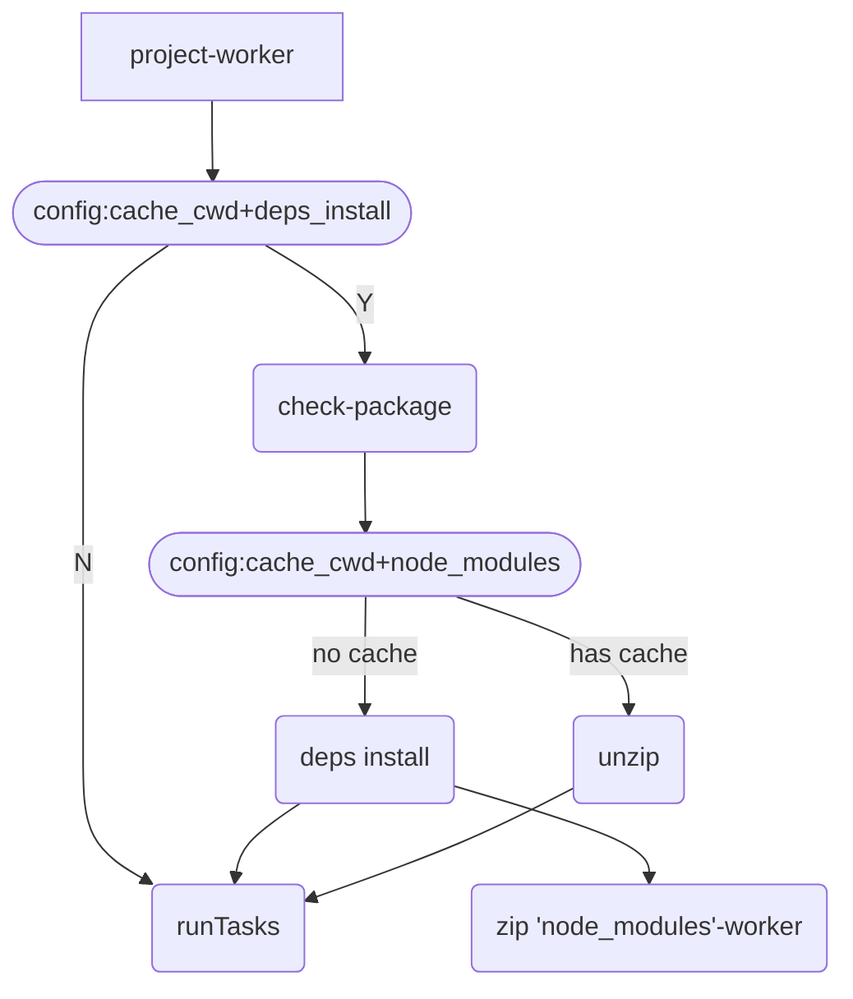

# taskk

English | [中文](./README-zhCN.md)

Multi-process execution Multi-project + Project Tasks executes in sequence

Code running diagram




The simplest `projects` configuration is as follows:

```js
const projects_build_prod = [
  { name: 'my-vue-app', tasks: ['npm run build:prod'] },
  { name: 'my-react-app', tasks: ['npm run build:prod'] },
];
```

> Each `item` of `projects` is independent of each other **multiple processes are executed in parallel**, and `tasks` under each `item` is executed **synchronously in sequence**


## Where

Using `terminal`/`git bash`

`node >= 10`


## Install

- Local installation

```shell
npm i -D taskk
```

Configure `npm scripts` execute `taskk`, see `_example` folder

```json
  "scripts": {
    "build:prod": "cross-env BUILD_ENV=prod taskk"
  }
```

- Global installation

```shell
npm i -g taskk
```

There is no need to configure `taskk` in `npm scripts`; `taskk` is available globally


## Feature

- Simple to use: provide a `taskk-tool.js` file, global installation can be executed in the terminal `taskk`
- Dynamic configuration: `taskk-tool.js` -> `get_config function`  returns `config/projects`
- Multi-process execution: `child_process.fork` creates a child process; `tasks` under each `item` is executed **synchronously in sequence**
- Dependency installation management: `config.deps_install`, detects `package.json` updates, redownloads dependencies (works when `config.cache_cwd` is in effect)
- node_modules cache management: `config.node_modules`, handles the `node_modules` cache and backup, etc. (works when `config.cache_cwd` is in effect)
- Any task fails to execute: `config.errorToExit: true`, which can be enabled only if all tasks succeed. It will kill all children of the main process and exit all tasks
- Pure execution: `config.spawnStdio: 'ignore'`, in which case the execution of `item.tasks` will not print, only a small amount of process-related content is printed
- Execution time statistics: prints the time when subitems `item.tasks` of `projects` are executed
- Unified output: it is convenient to copy the construction product `item.output` of all subprojects of `projects` to the external specified path `config.projectsDist`
- The completed callback `run_all_done`: `taskk-tool.js` -> `run_all_done function` will be called after normal execution


## Parameter Description

You can manually `require('taskk/types/index.js')`, and then `JSDoc` can be used for syntax annotation

- `TaskkConfig`: config field type

| Field            | Type              | Required | Default     | Description |
| ---------------- | ----------------- | -------- | ----------- | --------------------------------------- |
| cache_cwd        | string            | no       | ""          | Cache path, excluding name; And `deps_install`/`node_modules` in combination |
| deps_install     | string            | no       | ""          | Dependency installation command, such as `npm install`/`yarn`/`pnpm install`; Detect `package.json` update and re download dependency; If it is not configured, you need to manually download the dependency, or add a dependency download command in `tasks`; works when `config.cache_cwd` is in effect |
| node_modules     | boolean           | no      | false       | Process `node_modules` cache and backup, etc; works when `config.cache_cwd` is in effect |
| spawnStdio       | inherit \| ignore | no      | inherit     | `spawn` output mode of executing `tasks` (`option. stdio`); `ignore` the output of `tasks` will not be printed. At this time, only a small number of process prompts will be printed |
| errorToExit      | boolean           | no      | false       | if `true`, when any `tasks` fails to execute, it will kill all children of the main process and exit all tasks; `run_all_done` **will not be executed** |
| projectsDist     | string            | no      | ""          | After all the projects are executed, the `output` of each item will be copied here |
| forceUpdateCache | boolean           | no      | false       | Sometimes `node_modules` unzip from the cache directory without error, but when the project cannot run, you can **temporarily set true**; The cache will be deleted and updated after the dependency is re downloaded (remember to **set false** after success, otherwise the subsequent cache will **not work**!) |

- `ProjectItem`: Type of each item in projects

| Field   | Type    | Required  | Description |
| ------- | ------- | --------- | ------------------------------------------------ |
| name    | string  | yes       | Keep consistent with the project folder name. When executing the `shell` command, you need to obtain the `cwd`   |
| tasks   | string  | yes       | List of `shell` commands to be executed |
| output  | string  | no        | The directory name of the output of the execution build, used in combination with `config.projectsdist`  |

- `TaskResult`: Result of execution

| Field     | Type    | Description     |
| --------- | ------- | --------------- |
| type      | string  | Execution stage flag of the task  |
| name      | string  | project name    |
| succeed   | boolean | success or not  |


## Usage

Generally used for multi-project build management, it has the following directory structure:

```
.
├── my-react-app
├── my-vue-app
├── package.json
└── taskk-tool.js
```

Where `my-react-app` and `my-vue-app` are two independent projects, `taskk-tool.js` is a configuration file

### Configuration file

Under the top-level folder of multiple projects, create a new file `taskk-tool.js`. You need to export several data:

- get_config: `() => {config, projects}`
  - config `TaskkConfig`: see **Parameter Description**
  - projects `ProjectItem[]`: see **Parameter Description**
- run_all_done: `(task_results: TaskResult[]) => void`
  - Execute after all are successful
  - When `config.errorToExit: true`, it will not be called

When `config.spawnStdio: 'ignore'`, output:

```shell
xxx@xxxdeMacBook-Pro _example $ taskk
  _____  _    ____  _  ___  __
 |_   _|/ \  / ___|| |/ / |/ /
   | | / _ \ \___ \| ' /| ' / 
   | |/ ___ \ ___) | . \| . \ 
   |_/_/   \_\____/|_|\_\_|\_\
                               taskk | v0.1.0
[2022/8/16 16:31:42]
[/Users/xxx/Desktop/FE/taskk/_example]

config: 
 {
  spawnStdio: 'ignore',
  deps_install: 'npm install --registry=http://registry.npmmirror.com',
  cache_cwd: '/Users/xxx/Desktop/FE/taskk/_example/_example-cache',
  projectsDist: '/Users/xxx/Desktop/FE/taskk/_example/_example-dist'
}
projects: 
┌─────────┬────────────────┬──────────────────────────┬─────────┐
│ (index) │      name      │          tasks           │ output  │
├─────────┼────────────────┼──────────────────────────┼─────────┤
│    0    │  'my-vue-app'  │ [ 'npm run build:prod' ] │ 'dist'  │
│    1    │ 'my-react-app' │ [ 'npm run build:prod' ] │ 'build' │
└─────────┴────────────────┴──────────────────────────┴─────────┘
[my-react-app] => ["npm run build:prod"] => start
[my-vue-app] => ["npm run build:prod"] => start

[my-vue-app] => ["npm run build:prod"] => done, used:3.981s

[my-react-app] => ["npm run build:prod"] => done, used:6.421s

projectsDist => [/Users/xxx/Desktop/FE/taskk/_example/_example-dist] => start

/Users/xxx/Desktop/FE/taskk/_example/my-vue-app/dist
/Users/xxx/Desktop/FE/taskk/_example/_example-dist/my-vue-app

/Users/xxx/Desktop/FE/taskk/_example/my-react-app/build
/Users/xxx/Desktop/FE/taskk/_example/_example-dist/my-react-app

projectsDist => [/Users/xxx/Desktop/FE/taskk/_example/_example-dist] => done


开始时间: Tue Aug 16 2022 16:31:42 GMT+0800 (中国标准时间)
结束时间: Tue Aug 16 2022 16:31:49 GMT+0800 (中国标准时间)

====== build_done ======

```

The contents of `taskk-tool.js` file are as follows:

```js
// _example\taskk-tool.js
const path = require('path');
const { exec } = require('child_process');
const { writeFile } = require('fs');
const colors = require('colors');
require('taskk/types/index.js');

const start = new Date();

/**
 * 配置信息
 * @type {TaskkConfig}
 */
const config = {
  spawnStdio: 'ignore',
  // node_modules: true,
  deps_install: 'npm install --registry=http://registry.npmmirror.com',
  cache_cwd: path.join(process.cwd(), '_example-cache'),
  projectsDist: path.resolve(process.cwd(), '_example-dist'),
  // forceUpdateCache: true,
  // errorToExit: true,
};

/**
 * @type {ProjectItem[]}
 */
const projects_build_dev = [
  { name: 'my-vue-app', tasks: ['npm run build:dev'], output: 'dist' },
  { name: 'my-react-app', tasks: ['npm run build:dev'], output: 'build' },
];
const projects_build_prod = [
  { name: 'my-vue-app', tasks: ['npm run build:prod'], output: 'dist' },
  { name: 'my-react-app', tasks: ['npm run build:prod'], output: 'build' },
];

/**
 * 获取配置的方法
 * @returns {{config: TaskkConfig, projects: ProjectItem[]}}
 */
exports.get_config = function get_config() {
  if (process.env.BUILD_ENV === 'dev') {
    return { config, projects: projects_build_dev };
  }
  return { config, projects: projects_build_prod };
};

/**
 * 构建结束后执行
 * @description errorToExit: true时不执行，此时某一个执行失败将会杀掉所有相关子进程
 * @param {TaskResult[]} task_results 执行结果
 */
exports.run_all_done = function run_all_done(task_results) {
  console.log(`\n开始时间: ${start}\n结束时间: ${new Date()}\n`);
  if (task_results.every((i) => i.succeed)) {
    console.log(colors.cyan('====== build_done ======\n'));
  } else {
    console.warn(colors.red('====== 构建失败 ======\n'));
  }
};
```


## End

It ends here
